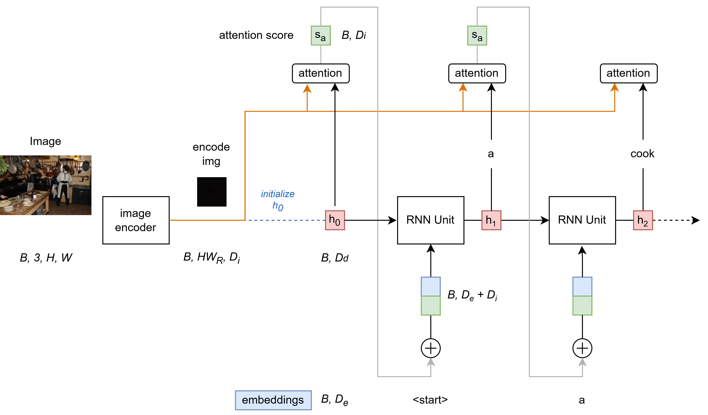

# Tutorial: image-captioning in your language
This project is to play with RNN and Transformer architectures through the image captioning task. Moreover, it becomes more interesting when approached in your language.

## Project Overview
### Objective
The main goal is to comprehend the architecture of the encoder-decoder model based on RNN and transformer networks, as well as the fundamental pipeline in image captioning.

### Dataset
The project utilizes the COCO2017 dataset, employing the train/val datasets and annotations available from the provided [link](https://cocodataset.org/#download).

## Translation and Preprocessing
### Translation
The [Facebook/NLLB-200-Distilled-600M](https://huggingface.co/facebook/nllb-200-distilled-600M) translation model from Hugging Face is employed to translate English into other desired languages. To obtain a dataset with captions in your language, execute the following command:
```
python captions_translator.py
```

### Data Preprocessing
For efficient data loading, image values are stored in `.hdf5` format, and corresponding captions for each image are gathered from the original annotations. To preprocess the data, execute the following command:
```
python create_input_files.py
```

## Model Architectures
### LSTM
Over view of the LSTM-based encoder-decoder model.


### Transformer
`Soon be added`

## Training
```
python train.py
```

## Evaluation
Evaluation metrics: BLEU
```
python eval.py
```
